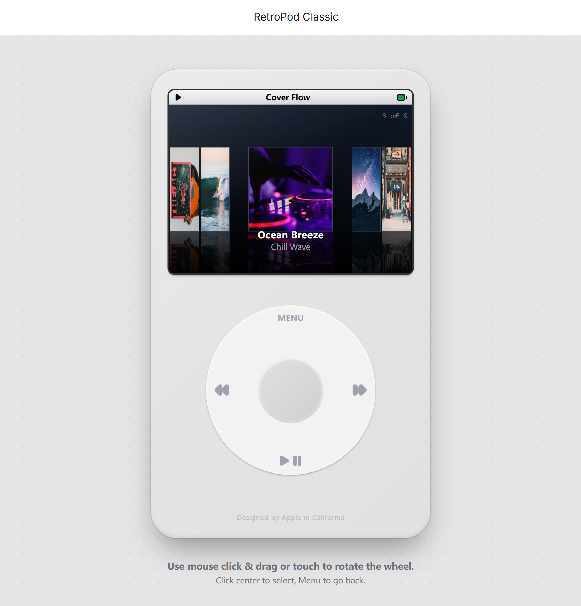

# RetroPod Classic



一个基于 Web 的 iPod Classic 模拟器，在浏览器里重现经典的点按滚轮交互体验。

---

## ✨ 功能特性

- **Click Wheel 滚轮交互** — 支持鼠标拖拽与触屏操作，还原真实 iPod 旋转体验
- **音乐播放器** — 内置默认曲库，支持上一曲/下一曲/暂停，自动播放下一首
- **Cover Flow** — 专辑封面流式浏览，经典视觉呈现
- **媒体库管理** — 可通过本地文件或远程 URL 自行添加/删除音乐与照片
- **照片浏览器** — 网格预览 + 滑动翻页查看
- **自动读取音频元数据** — 从本地音频文件中自动提取歌名、艺术家、专辑封面
- **持久化存储** — 媒体库数据保存至 localStorage，刷新后不丢失
- **多级菜单导航** — 完整还原 iPod 菜单层级：Music → Artists / Albums / Songs / Cover Flow

---

## 🛠 技术栈

| 技术 | 说明 |
|------|------|
| React 19 | UI 框架 |
| TypeScript 5.8 | 类型安全 |
| Vite 6 | 构建工具 |
| Lucide React | 图标库 |
| jsmediatags | 本地音频元数据解析 |

---

## 🚀 本地运行

**前置要求：** Node.js 18+

```bash
# 1. 安装依赖
npm install

# 2. 启动开发服务器
npm run dev
```

浏览器访问 `http://localhost:5173`

### 构建生产版本

```bash
npm run build
npm run preview
```

---

## 🎮 操作说明

| 操作 | 功能 |
|------|------|
| 鼠标拖拽滚轮 / 触屏滑动 | 滚动菜单 |
| 点击中央按钮 | 选择/确认 |
| 点击 MENU 按钮 | 返回上一级菜单 |
| 点击 ⏮ / ⏭ 按钮 | 上一曲 / 下一曲 |
| 点击 ▶‖ 按钮 | 播放 / 暂停 |

### 添加自定义媒体

进入 **Settings → Media Library**：

- **Add Music** — 从本地文件导入（支持 MP3、AAC、FLAC 等），或输入远程 URL
- **Add Photos** — 从本地文件导入图片，或输入远程图片 URL
- **Manage Music / Manage Photos** — 删除已添加的媒体项目

---

## 📁 项目结构

```
RetroPod-Classic/
├── components/
│   ├── IPod.tsx              # 主组件，状态与事件中枢
│   ├── ClickWheel.tsx        # 滚轮组件（鼠标/触屏交互）
│   ├── Screen.tsx            # 屏幕路由渲染
│   └── ScreenComponents/
│       ├── Menu.tsx          # 通用菜单列表
│       ├── NowPlaying.tsx    # 正在播放页面
│       ├── CoverFlow.tsx     # Cover Flow 封面流
│       ├── PhotoGrid.tsx     # 照片网格
│       ├── PhotoViewer.tsx   # 照片全屏浏览
│       ├── MediaInput.tsx    # 媒体添加输入界面
│       └── StatusBar.tsx     # 顶部状态栏
├── contexts/
│   └── MediaLibraryContext.tsx  # 媒体库全局状态
├── hooks/
│   ├── useAudioPlayer.ts    # 音频播放逻辑
│   └── useClickWheel.ts     # 滚轮手势识别
├── services/
│   ├── storage.ts           # localStorage 持久化
│   └── audioMetadata.ts     # 音频元数据读取
├── constants.ts             # 默认曲库 & 菜单配置
├── types.ts                 # TypeScript 类型定义
└── App.tsx                  # 应用入口
```

---

## 📜 License

MIT
